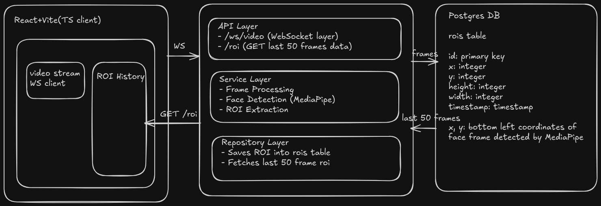

# Real-Time Face Detection System

A containerized full-stack application that performs real-time face detection on video streams using WebSockets, FastAPI, MediaPipe, and React.

## Overview

This application captures video frames from a webcam, sends them to a backend service, detects a face, draws a bounding box (ROI), stores metadata in PostgreSQL, and streams the processed frames back to the frontend.

## Application Design/Development strategy:



## Note on Development Approach

Due to time constraints and ongoing professional commitments, this project was built with the assistance of AI tools such as GPT alongside official documentation.

Additionally:

* This is my **first project using Python and FastAPI**
* The focus was on **correct architecture, system integration, and delivery**

## Tech Stack

### Backend

* FastAPI
* WebSockets
* MediaPipe (Face Detection)
* Pillow (Image Processing)
* PostgreSQL
* SQLAlchemy

### Frontend

* React (Vite + TypeScript)
* TailwindCSS
* TanStack Query

### Infrastructure

* Docker
* Docker Compose
* Make

## Design Decisions

### Why MediaPipe instead of OpenCV (As per assignment description)?

* MediaPipe is **lightweight and optimized** for face detection
* Provides out-of-the-box face detection models
* Better suited for this scoped real-time use case

## Prerequisites

Make sure you have the following installed:

* Docker
* Docker Compose
* Make

### Installation Links

* Docker: https://docs.docker.com/get-docker/
* Docker Compose: https://docs.docker.com/compose/install/
* Make: https://www.gnu.org/software/make/

## Running the Application

```bash
git clone https://github.com/Cheemx/face-tracker
cd face-tracker
make run
```

The application will be available at:

http://localhost:5173

## First Build Time

The initial build may take **3–5 minutes**, depending on your internet speed, as Docker images and dependencies are downloaded.

## API Design

The backend currently exposes:

* WebSocket endpoint for streaming frames
* REST endpoint to fetch ROI history (`GET /roi`)

> Note: The system primarily uses WebSockets for real-time communication. For this specific use case (single-user stream), HTTP could also have been sufficient. WebSockets become more valuable in scenarios involving broadcasting or multi-client streaming.

## Data Handling

* ROI (Region of Interest) metadata is stored in PostgreSQL
* Each record includes:

  * coordinates
  * dimensions
  * timestamp

Currently:

* Only the **last 50 records** are fetched (no pagination yet)

## Future Improvements

### 1. Message Queue Integration

Instead of making frequent DB writes (~5/sec), introduce:

* Kafka / RabbitMQ
* Buffer and batch writes for scalability

---

### 2. Image Storage (AWS S3)

* Store selected frames in S3
* Save image URI in DB
* Enable audit/history use cases

### 3. Pagination for ROI History

* Replace fixed limit (50)
* Add proper pagination and filtering

### 4. Multi-User / Streaming Architecture

* Current system handles a single stream
* Can be extended for:

  * multi-client broadcasting
  * shared streams

## Conclusion
*If you've read it till this end, consider giving a star!*

*Built with ❤️ using Python, designed as an assignment by Cheems!*